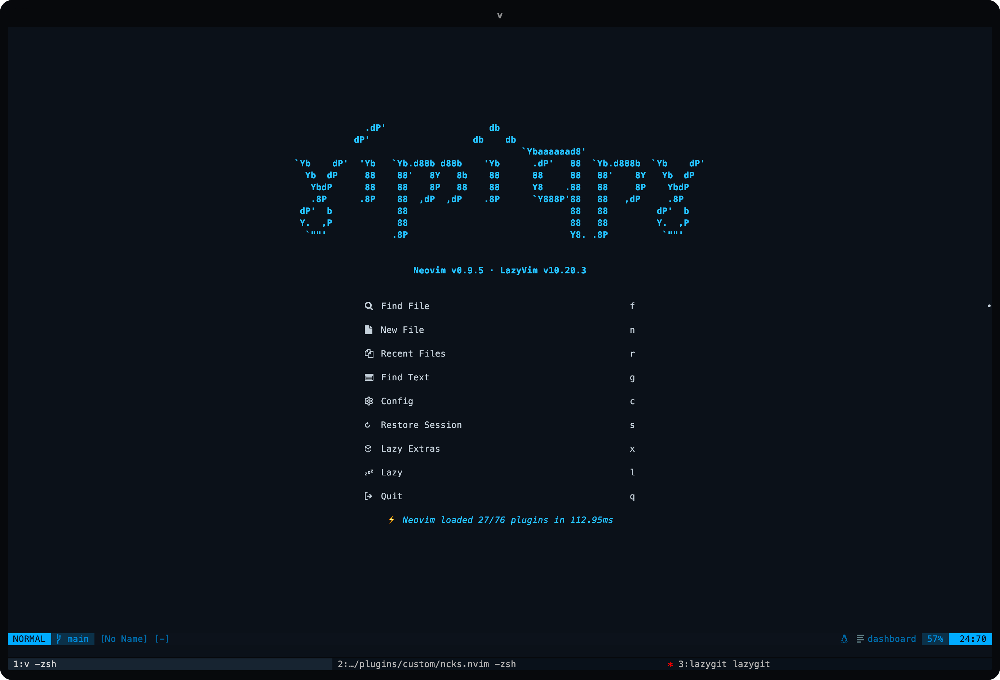
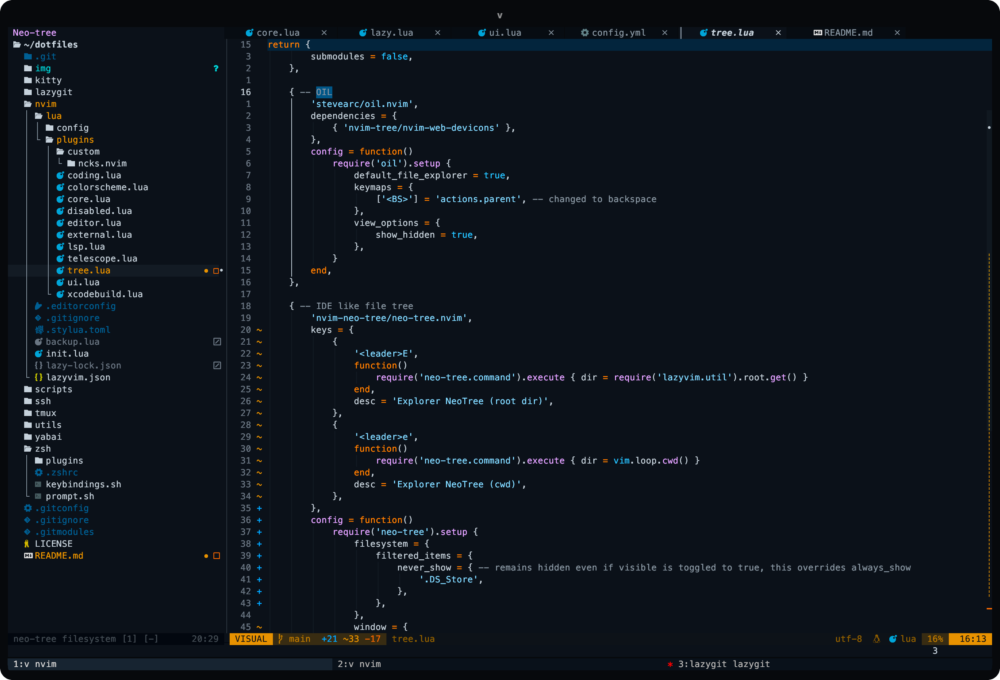
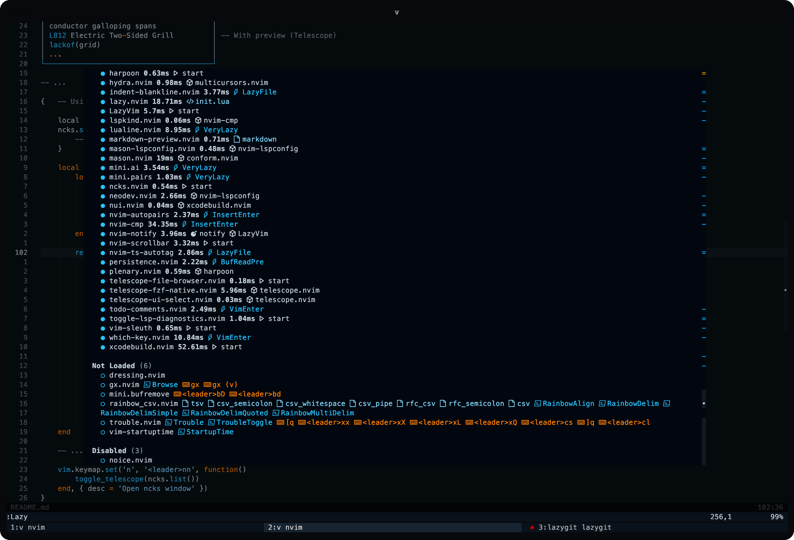
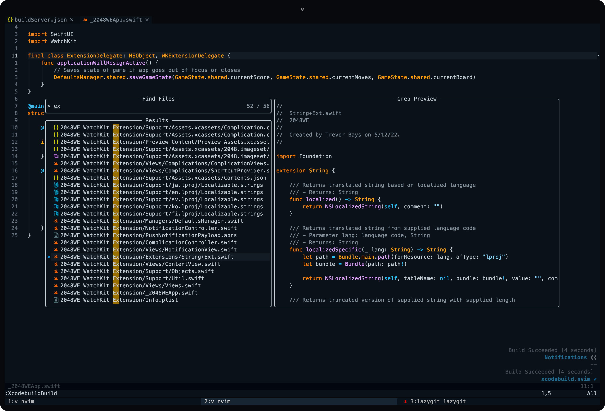

### Aliases

##### General

[zshrc](./zsh/.zshrc)

```bash
alias v='nvim' nv='nvim'
alias z-='z -'
alias cd..='z ..'
alias ..='z ..'
alias l='ls -t'
alias ll='ls -altrF'
alias lsa='ls -hla'
alias lsr='ls -lR'
alias lsf='ls -1 | wc -l'
alias lss='du -sh *'
alias la='ls -A'
alias ls='ls -CF'
alias cls='clear'
alias oldtop="/usr/bin/top"
alias nf="neofetch"
alias of="onefetch --no-color-palette --include-hidden -E --no-title"
alias ep="echo $PATH"
alias resh="source ~/.zshrc"
alias vzsh='kitty @ launch --type=tab nvim --remote-silent ~/.zshrc'
alias vlua='kitty @ launch --type=tab nvim --remote-silent ~/dotfiles/nvim'
alias monkeytype='z ~/Dev/monkeytype-24.22.0/; pnpm dev-fe'
alias zfq='zoxide query -l -s | less'
```

##### Commands

```bash
alias ftl='find . -type f -name "*.*" -exec basename {} \; | sed "s/.*\.//" | sort -u'
```

##### Git

```bash
alias ga='git add'
alias gaa='git add .'
alias gaaa='git add -A'
alias gc='git commit'
alias gcm='git commit -m'
alias gcr='git clone'
alias gd='git diff'
alias gi='git init'
alias gl='git log'
alias gp='git pull'
alias gpsh='git push'
alias gss='git status'
alias gcnt='git ls-files | wc -l'
alias lg='lazygit'
```

---

### Yabai/skhd

[yabairc](./yabai/.yabairc)
[skhdrc](/yabai/..skhdrc)

```bash
alias ystart='yabai --start-service'
alias ystop='yabai --stop-service'
alias yupgrade='brew upgrade yabai'
alias skstart='skhd --start-service'
alias skstop='skhd --stop-service'
```

---

#### Neovim Summary

Neovim: [v0.9.5](https://github.com/neovim/neovim) · LazyVim: [v10.22.0](https://github.com/LazyVim/LazyVim) · Colorscheme: [github_dark_colorblind](https://github.com/projekt0n/github-nvim-theme)

[nvim](./nvim/)

```lua
Total: 89 plugins

  Loaded (69)
    ● align.nvim 0.07ms  start -- https://github.com/Vonr/align.nvim
    ● alpha-nvim 3.38ms  VimEnter -- https://github.com/goolord/alpha-nvim
    ● bufferline.nvim 4.84ms  VeryLazy -- https://github.com/akinsho/bufferline.nvim
    ● cmp-buffer 0.2ms  nvim-cmp -- https://github.com/hrsh7th/cmp-buffer
    ● cmp-cmdline 0.18ms  nvim-cmp -- https://github.com/hrsh7th/cmp-cmdline
    ● cmp-nvim-lsp 0.17ms  nvim-cmp -- https://github.com/hrsh7th/cmp-nvim-lsp
    ● cmp-path 0.17ms  nvim-cmp -- https://github.com/hrsh7th/cmp-path
    ● cmp_luasnip 0.15ms  nvim-cmp -- https://github.com/saadparwaiz1/cmp_luasnip
    ● Comment.nvim 2.26ms  start -- https://github.com/numToStr/Comment.nvim
    ● conform.nvim 19.77ms  start -- https://github.com/stevearc/conform.nvim
    ● fidget.nvim 3.36ms  nvim-lspconfig -- https://github.com/j-hui/fidget.nvim
    ● flash.nvim 2.3ms  VeryLazy -- https://github.com/folke/flash.nvim
    ● friendly-snippets 14.04ms  LuaSnip -- https://github.com/rafamadriz/friendly-snippets
    ● gitsigns.nvim 5.68ms  nvim-scrollbar -- https://github.com/lewis6991/gitsigns.nvim
    ● go.nvim 10.32ms  CmdlineEnter -- https://github.com/ray-x/go.nvim
    ● guihua.lua 1ms  go.nvim -- https://github.com/ray-x/guihua.lua
    ● harpoon 0.71ms  start -- https://github.com/ThePrimeagen/harpoon
    ● head.nvim 4.05ms  start -- https://github.com/956MB/head.nvim
    ● hydra.nvim 0.69ms  multicursors.nvim -- https://github.com/smoka7/hydra.nvim
    ● indent-blankline.nvim 4.91ms  LazyFile -- https://github.com/lukas-reineke/indent-blankline.nvim
    ● lazy.nvim 25.56ms  init.lua -- https://github.com/956MB/lazy.nvim
    ● lazydev.nvim 1.6ms  lua -- https://github.com/folke/lazydev.nvim
    ● LazyVim 4.83ms  start -- https://github.com/LazyVim/LazyVim
    ● lspkind.nvim 0.18ms  nvim-cmp -- https://github.com/onsails/lspkind.nvim
    ● lspmark.nvim 3.87ms  start -- https://github.com/tristone13th/lspmark.nvim
    ● lualine.nvim 17.24ms  VeryLazy -- https://github.com/nvim-lualine/lualine.nvim
    ● LuaSnip 32.85ms  start -- https://github.com/L3MON4D3/LuaSnip
    ● markdown-preview.nvim 1.1ms  markdown -- https://github.com/iamcco/markdown-preview.nvim
    ● mason-lspconfig.nvim 0.23ms  nvim-lspconfig -- https://github.com/williamboman/mason-lspconfig.nvim
    ● mason-tool-installer.nvim 1.05ms  nvim-lspconfig -- https://github.com/WhoIsSethDaniel/mason-tool-installer.nvim
    ● mason.nvim 19.09ms  conform.nvim -- https://github.com/williamboman/mason.nvim
    ● mini.ai 0.64ms  VeryLazy -- https://github.com/echasnovski/mini.ai
    ● mini.comment 0.37ms  VeryLazy -- https://github.com/echasnovski/mini.comment
    ● mini.indentscope 0.86ms  LazyFile -- https://github.com/echasnovski/mini.indentscope
    ● mini.nvim 1.69ms  start -- https://github.com/echasnovski/mini.nvim
    ● mini.pairs 1.27ms  VeryLazy -- https://github.com/echasnovski/mini.pairs
    ● multicursors.nvim 5.26ms  VeryLazy -- https://github.com/smoka7/multicursors.nvim
    ● ncks.nvim 0.76ms  start -- https://github.com/956MB/ncks.nvim
    ● neo-tree.nvim 12.23ms 󰢱 neo-tree.events  xcodebuild.nvim -- https://github.com/nvim-neo-tree/neo-tree.nvim
    ● neodev.nvim 15.04ms  start -- https://github.com/folke/neodev.nvim
    ● nui.nvim 0.04ms  xcodebuild.nvim -- https://github.com/MunifTanjim/nui.nvim
    ● nvim-cmp 16.05ms  LuaSnip -- https://github.com/hrsh7th/nvim-cmp
    ● nvim-dap 76.72ms  start -- https://github.com/mfussenegger/nvim-dap
    ● nvim-dap-ui 0.36ms 󰢱 dapui  nvim-dap -- https://github.com/rcarriga/nvim-dap-ui
    ● nvim-lint 2.06ms  LazyFile -- https://github.com/mfussenegger/nvim-lint
    ● nvim-lspconfig 13.51ms 󰢱 lspconfig.util  neodev.nvim -- https://github.com/neovim/nvim-lspconfig
    ● nvim-nio 0.24ms  nvim-dap-ui -- https://github.com/nvim-neotest/nvim-nio
    ● nvim-notify 3.7ms 󰢱 notify  LazyVim -- https://github.com/rcarriga/nvim-notify
    ● nvim-scrollbar 6.71ms  start -- https://github.com/petertriho/nvim-scrollbar
    ● nvim-treesitter 9.71ms  VeryLazy -- https://github.com/nvim-treesitter/nvim-treesitter
    ● nvim-treesitter-textobjects 3.16ms  VeryLazy -- https://github.com/nvim-treesitter/nvim-treesitter-textobjects
    ● nvim-ts-autotag 4.54ms  LazyFile -- https://github.com/windwp/nvim-ts-autotag
    ● nvim-web-devicons 16.85ms  telescope.nvim -- https://github.com/nvim-tree/nvim-web-devicons
    ● obsidian.nvim 21.97ms  markdown -- https://github.com/epwalsh/obsidian.nvim
    ● oil.nvim 3.05ms  start -- https://github.com/956MB/oil.nvim
    ● persistence.nvim 4.07ms 󰢱 persistence  lua -- https://github.com/folke/persistence.nvim
    ● plenary.nvim 0.64ms  harpoon -- https://github.com/nvim-lua/plenary.nvim
    ● sobrio 0.4ms colorscheme sobrio  LazyVim -- https://github.com/956MB/sobrio
    ● telescope-file-browser.nvim 0.05ms  start -- https://github.com/nvim-telescope/telescope-file-browser.nvim
    ● telescope-fzf-native.nvim 6.62ms  telescope.nvim -- https://github.com/nvim-telescope/telescope-fzf-native.nvim
    ● telescope-ui-select.nvim 0.06ms  telescope.nvim -- https://github.com/nvim-telescope/telescope-ui-select.nvim
    ● telescope.nvim 38.89ms  xcodebuild.nvim -- https://github.com/nvim-telescope/telescope.nvim
    ● todo-comments.nvim 3.46ms  VimEnter -- https://github.com/folke/todo-comments.nvim
    ● toggle-lsp-diagnostics.nvim 0.92ms  start -- https://github.com/WhoIsSethDaniel/toggle-lsp-diagnostics.nvim
    ● trouble.nvim 2.91ms 󰢱 trouble  lualine.nvim -- https://github.com/folke/trouble.nvim
    ● vim-kitty 0.46ms  start -- https://github.com/fladson/vim-kitty
    ● vim-sleuth 0.9ms  start -- https://github.com/tpope/vim-sleuth
    ● which-key.nvim 13.52ms  VimEnter -- https://github.com/folke/which-key.nvim
    ● xcodebuild.nvim 71.84ms  nvim-dap -- https://github.com/wojciech-kulik/xcodebuild.nvim

  Not Loaded (14)
    ○ catppuccin -- https://github.com/catppuccin/nvim
    ○ copilot.lua  InsertEnter  Copilot -- https://github.com/zbirenbaum/copilot.lua
    ○ dressing.nvim -- https://github.com/stevearc/dressing.nvim
    ○ gx.nvim  gx (v)  gx  Browse -- https://github.com/chrishrb/gx.nvim
    ○ lazygit.nvim  <leader>lg  LazyGitCurrentFile  LazyGitFilter  LazyGitFilterCurrentFile  LazyGit  LazyGitConfig -- https://github.com/kdheepak/lazygit.nvim
    ○ luvit-meta -- https://github.com/Bilal2453/luvit-meta
    ○ nvim-autopairs  InsertEnter -- https://github.com/windwp/nvim-autopairs
    ○ nvim-spectre  <leader>sr  Spectre -- https://github.com/nvim-pack/nvim-spectre
    ○ nvim-ts-context-commentstring -- https://github.com/JoosepAlviste/nvim-ts-context-commentstring
    ○ rainbow_csv.nvim  csv  tsv  csv_semicolon  csv_whitespace  csv_pipe  rfc_csv  rfc_semicolon  RainbowMultiDelim  RainbowAlign  RainbowDelim  RainbowDelimSimple  RainbowDelimQuoted -- https://github.com/cameron-wags/rainbow_csv.nvim
    ○ toggleterm.nvim  <C-\> -- https://github.com/akinsho/toggleterm.nvim
    ○ vim-dadbod  vim-dadbod-ui -- https://github.com/tpope/vim-dadbod
    ○ vim-dadbod-completion  sqlite  sql  mysql  plsql  vim-dadbod-ui -- https://github.com/kristijanhusak/vim-dadbod-completion
    ○ vim-dadbod-ui  DBUIFindBuffer  DBUI  DBUIToggle  DBUIAddConnection -- https://github.com/kristijanhusak/vim-dadbod-ui

  Disabled (6)
    ○ dashboard-nvim -- https://github.com/nvimdev/dashboard-nvim
    ○ noice.nvim -- https://github.com/folke/noice.nvim
    ○ nvim -- https://github.com/catppuccin/nvim
    ○ nvim-snippets  nvim-cmp -- https://github.com/garymjr/nvim-snippets
    ○ tokyonight.nvim -- https://github.com/folke/tokyonight.nvim
    ○ ts-comments.nvim -- https://github.com/folke/ts-comments.nvim
```

```python
                 -- --                    Project: dotfiles (2 branches)
         --                 -- @@@@       HEAD: 804523a (main)
      --      @@@@@@@@@@@     @@@@@@      Pending: 1+- 1+
           @@@@@@@@@@@@@@@@@   @@@@       Created: 2 months ago
  --     @@@@@@@@@@@@@@****@@@     --     Languages:                            
 --    @@@@@@@@@@@@@@@******@@@@    --               ● Lua (89.1 %) ● Shell (4.1 %)
      @@@@@@@@@@@@@@@@@****@@@@@@                    ● BASH (3.5 %) ● Python (2.1 %)
--   @@@**@@@@@@@@@@@@@@@@@@@@@@@@   --              ● Zsh (1.2 %) 
--   @@@**@@@@@@**@@**@@******@@@@   --   Author: 100% Alexander Bays <bays@956mb.com> 40
     @@@**@@@@@@**@@**@**@@@**@@@@        Last change: a minute ago
--   @@@**@@@@@@**@@**@@@*****@@@@   --   URL: https://github.com/956MB/dotfiles.git
--   @@@**@@@@@@**@@**@***@@**@@@@   --   Commits: 40
      @@*******@******@********@@         Churn (2): …/config/keymaps.lua 1
 --    @@@@@@@@@@@@@@@@@@@@@@@@@    --               …/plugins/ui.lua 1
  --     @@@@@@@@@@@@@@@@@@@@@     --     Lines of code: 2888
           @@@@@@@@@@@@@@@@@              Size: 1.47 MiB (60 files)
      --      @@@@@@@@@@@      --         License: MIT
         --                 --         
                 -- --                 

```

## License

[MIT license](./LICENSE)
