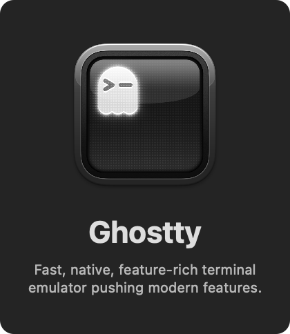

<p align="center">
    <a href="https://github.com/ghostty-org/ghostty">
        
    </a>
</p>


### Aliases

[fish/aliases.fish](./fish/conf.d/aliases.fish)

##### General

```bash
alias v='nvim'                                                         # Open neovim
alias nv='nvim'                                                        # Open neovim (alternative)
alias z-='z -'                                                         # Navigate to previous directory using zoxide
alias cd..='z ..'                                                      # Go up one directory using zoxide
alias z..='z ..'                                                       # Go up one directory using zoxide (alternative)
alias ..='z ..'                                                        # Go up one directory using zoxide
alias ...='z ../..'                                                    # Go up two directories using zoxide
alias ....='z ../../..'                                                # Go up three directories using zoxide
alias zfreq='zoxide query -l'                                          # List most frequently used directories
alias yy='yazi'                                                        # Open yazi
alias fct='find . -maxdepth 1 -type d ! -name ".*" | wc -l'            # Count number of directories in the current directory (excluding hidden ones)
alias func='functions'                                                 # List all functions
alias cat='bat'                                                        # Use bat instead of cat
alias oldcat='cat'                                                     # Use original cat
alias l='eza --group-directories-first'                                # List with icons, directories first
alias ls='eza --group-directories-first'                               # List with icons, directories first
alias ll='eza -l --group-directories-first'                            # Long format with icons
alias la='eza -la --group-directories-first'                           # List all (including hidden) with icons
alias lt='eza --tree --icons'                                          # Tree view with icons
alias l.='eza -a | grep -E "^\."'                                      # Show only hidden files
alias lsa='eza -la --group-directories-first'                          # List all with icons (including hidden)
alias lsr='eza -R --icons'                                             # List recursively
alias lsf='eza -1 | wc -l'                                             # Count number of files
alias lss='eza -la --group-directories-first --sort=size'              # Sort by size
alias cls='clear'                                                      # Clear the terminal screen
alias oldtop="/usr/bin/top"                                            # Run the original top command
alias nf="neofetch"                                                    # Display system information using neofetch
alias of="onefetch --no-color-palette --include-hidden -E --no-title"  # Display git repository information using onefetch
alias ep="echo $PATH"                                                  # Print the PATH environment variable
alias resh="source ~/.config/fish/config.fish"                         # Reload the fish configuration
```

##### Zellij

[zellij/config.kdl](./zellij/config.kdl)

```bash
alias zsr='zellij ac rename-session'  # Rename zellij session <name>
alias zsa='zellij a'                  # Attach to zellij session <name>
alias zsl='zellij ls'                 # List zellij sessions
alias zsk='zellij k'                  # Kill zellij session <name>
alias zsd='zellij d'                  # Delete zellij session <name>
```

##### Commands

```bash
alias ftl='find . -type f -name "*.*" -exec basename {} \; | sed "s/.*\.//" | sort -u'  # List unique file extensions in current directory
```

##### Version control (`git` & `jj`)

```bash
alias ga='git add'                      # Stage changes
alias gaa='git add .'                   # Stage all changes in current directory
alias gaaa='git add -A'                 # Stage all changes
alias gc='git commit'                   # Commit changes
alias gcm='git commit -m'               # Commit changes with a message
alias gbr='git branch -M'               # Rename current branch
alias gcr='git clone'                   # Clone a repository
alias gd='git diff'                     # Show changes between commits, commit and working tree, etc.
alias gds='git diff --stat'             # Show diff stats (files changed, insertions, deletions)
alias gi='git init'                     # Initialize a new Git repository
alias gl='git log'                      # Show commit logs
alias gp='git pull'                     # Fetch from and integrate with another repository or a local branch
alias gpsh='git push'                   # Update remote refs along with associated objects
alias gss='git status'                  # Show the working tree status
alias gwho='git shortlog -s -n | head'  # Show top contributors
alias gcnt='git ls-files | wc -l'       # Count number of files in the repository
alias lg='lazygit'                      # Open Lazygit interface
alias grl='gh repo ls 956MB'            # List my repos on GitHub
alias grlf='gh repo ls 956MB --fork'    # List my forked repos on GitHub

# GitHub Copilot CLI function aliases
exp() {
    gh copilot explain "$*"
}
sug() {
    gh copilot suggest "$*"
}
```

```bash
alias jji='jj git init --colocate'       # Initialize a new jj repository
alias jjn='jj new'                       # Create a new working copy
alias jjcr='jj git clone'                # Clone a repository
alias jjf='jj git fetch'                 # Fetch changes from the remote
alias jjim='jj git import'               # Import remote refs into jj
alias jjex='jj git export'               # Export refs to a remote (use normal git push afterwards)
alias jjbl='jj bookmark list --all'      # List all bookmarks
alias jjbt='jj bookmark track'           # Track a branch
alias jjbc='jj bookmark create'          # Create a new bookmark
alias jjl='jj log'                       # Log our commits (excludes untracked remote branches)
alias jjlop='jj op log'                  # Log operations
alias jjla='jj log --all'                # Log all commits
alias jjdi='jj diff -r'                  # Show differences between commits
alias jjs='jj status'                    # Show the status of the repository
alias jjsp='jj split'                    # Select files to be commited and create new working copy
alias jjd='jj describe'                  # Describe any commit
alias jjdm='jj describe -m'              # Describe the current commit with message
alias jjrb='jj rebase -d'                # Rebase current commit onto a different branch
alias jjre='jj reset'                    # Reset the current working copy to a specific commit
alias jjco='jj checkout'                 # Switch working copy to a branch/commit
alias jjca='jj abandon'                  # Abandon current commit / working copy
alias jjup='jj git fetch; jj git import' # Shortcut for "pull" behavior
alias jjpush='jj git export; git push'   # Shortcut for "push"
alias jjpop='jj undo'                    # Alt name for "pop last operation"
alias jjw='jj workspace list'            # List all working copies
alias jjwf='jj workspace forget'         # Forget the current workspace (or given name)
alias jjwa='jj workspace add'            # Add a new workspace
alias lj='lazyjj'                        # Open Lazyjj interface
```

##### Yabai/skhd

[yabairc](./yabai/.yabairc) · [skhdrc](/yabai/..skhdrc)

```bash
alias ystart='yabai --start-service'      # Start yabai service
alias ystop='yabai --stop-service'        # Stop yabai service
alias yupgrade='brew upgrade yabai'       # Upgrade yabai using Homebrew
alias skstart='skhd --start-service'      # Start skhd service
alias skstop='skhd --stop-service'        # Stop skhd service
```

---

### Scripts & Fish functions

[aliaz](./scripts/zig/aliaz)

<sup>A better `alias` command, and my first thing written in Zig for fun. Uses color and description comments in `fish/conf.d/aliases.fish`.</sup>

[gcr.fish](./fish/functions/gcr.fish)

<sup>Clones a repo from https/ssh, and as backup uses github cli</sup>

```bash
gcr https://github.com/Next-Flip/Momentum-Firmware.git
```

[zj.fish](./fish/functions/zj.fish)

<sup>Opens a zellij session if it exists and creates it if not</sup>

```bash
zj # -> zellij attach <cwd> -c
```

[zsde.fish](./fish/functions/zsde.fish)

<sup>Delete all exited zellij sessions except the ones specified</sup>

```bash
zsde dotfiles|Momentum-Firmware.wiki # -> zellij ls -n | grep EXITED | grep -v "dotfiles\|Momentum-Firmware.wiki" | awk '{print $1}' | xargs -I {} zellij d {}
```

---

```python
# onefetch --no-color-palette --include-hidden -E --no-title --ascii-input "$(cat ./ascii_logo.txt)"

   ··////////////////////··/·   Project: dotfiles (3 branches)
 ·//·····/|/············/||/·   HEAD: 272a6b7 (main, origin/main)
·|·      ·|·           ·//·     Pending: 3+- 9+ 15-
/|       ·|·         ·//·       Created: a year ago
·|/     ·/|·       ·//·         Languages:
 ·///////|·      ·//·                      ● Lua (89.4 %) ● Fish (4.7 %)
    ····       ·//·      ·/·               ● BASH (1.6 %) ● Python (1.6 %)
             ·||·      ·//·                ● Zig (1.2 %) ● Shell (0.8 %)
           ·|//////···//·                  ● Other (0.6 %)
         ·||/·     ·||||·       Authors: 68% Alexander Bays <bays@956mb.com> 73
        ·//·       ///·//·               31% 956MB <bays@956mb.com> 33
      ·//·       /|/    ·|/               2% Alexander Bays <bays@MacBookPro.attlocal.net> 2
    ·//·       ·//        //    Last change: 9 minutes ago
  ·//·       ·//·         ·|·   URL: git@github.com:956MB/dotfiles.git
 //·       ·/||/··········/|/   Commits: 108
··         ·/··////////////··   Churn (2): starship/starship.toml 2
                                           yazi/keymap.toml 1
                                           yazi/theme.toml 1
                                Lines of code: 17381
                                Size: 26.05 MiB (126 files)
                                License: MIT
```

## License

[MIT license](./LICENSE)
