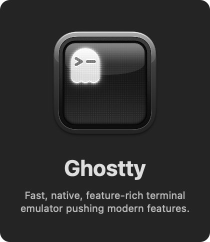

<p align="center">
    <a href="https://github.com/ghostty-org/ghostty">
        
    </a>
</p>


### `install.sh` script (for me)

I made this script for myself to make it easier starting on different systems, so the stuff inside is focused on my personal preferences and keeping my configs exactly the same. **Run at your own risk.**

```ruby
curl -fsSL https://raw.githubusercontent.com/956MB/dotfiles/main/install.sh | bash
```

The script will:

-   **Backup** existing configs (bat, btop, delta, fish, ghostty, herdr, nvim, yazi, zellij, starship.toml, .gitconfig)
-   **Install** Homebrew, Fish shell, and Fish tooling (eza, starship, zoxide, zellij, herdr)
-   **Clone** the repo and create symlinks for the same set of configs
-   **Install** packages from the [Brewfile](./Brewfile) (optional, with GUI/non-GUI prompts)
-   **Set** Fish as the default shell

It runs on macOS (Intel + Apple Silicon) and Linux, with an interactive menu on first launch.

```bash
./install.sh
./install.sh {-p, --packages-only}  # Packages only (no symlinks/shell changes)
./install.sh {-r, --revert}         # Revert to previous configuration (restores from backup)
```

---

### Aliases

[fish/aliases.fish](./fish/conf.d/aliases.fish)

##### General

```bash
alias v='nvim'                                                         # Open neovim
alias nv='nvim'                                                        # Open neovim (alternative)
alias z-='z -'                                                         # Navigate to previous directory using zoxide
alias cd..='z ..'                                                      # Go up one directory using zoxide
alias z..='z ..'                                                       # Go up one directory using zoxide (alternative)
alias ..='z ..'                                                        # Go up one directory using zoxide
alias ...='z ../..'                                                    # Go up two directories using zoxide
alias ....='z ../../..'                                                # Go up three directories using zoxide
alias zfreq='zoxide query -l'                                          # List most frequently used directories
alias yy='yazi'                                                        # Open yazi
alias fct='find . -maxdepth 1 -type d ! -name ".*" | wc -l'            # Count number of directories in the current directory (excluding hidden ones)
alias func='functions'                                                 # List all functions
alias cat='bat'                                                        # Use bat instead of cat
alias oldcat='cat'                                                     # Use original cat
alias l='eza --group-directories-first'                                # List with icons, directories first
alias ls='eza --group-directories-first'                               # List with icons, directories first
alias ll='eza -l --group-directories-first'                            # Long format with icons
alias la='eza -la --group-directories-first'                           # List all (including hidden) with icons
alias lt='eza --tree --icons'                                          # Tree view with icons
alias l.='eza -a | grep -E "^\."'                                      # Show only hidden files
alias lsa='eza -la --group-directories-first'                          # List all with icons (including hidden)
alias lsr='eza -R --icons'                                             # List recursively
alias lsf='eza -1 | wc -l'                                             # Count number of files
alias lss='eza -la --group-directories-first --sort=size'              # Sort by size
alias cls='clear'                                                      # Clear the terminal screen
alias top='btop'                                                       # Use btop instead of top
alias oldtop="/usr/bin/top"                                            # Run the original top command
alias nf="neofetch"                                                    # Display system information using neofetch
alias of='onefetch --no-color-palette --include-hidden -E --no-title --ascii-input "$(cat ~/dotfiles/logos/logo.txt)"'  # Display git repository information using onefetch with logo
alias ep="echo $PATH"                                                  # Print the PATH environment variable
alias resh="source ~/.config/fish/config.fish"                         # Reload the fish configuration
alias nvs="nvim ~/.scratch/$(date +%Y-%m-%d-%H%M%S).txt"               # Open a timestamped scratch file in neovim
alias mkd="mkdir"                                                      # Create a new directory
alias ld='lazydocker'                                                  # Open Lazydocker interface
alias ff='fastfetch --logo ~/dotfiles/logo.txt'                        # Display system info with logo
alias cl='linecounts'                                                  # List files sorted by line count
alias vzsh='nvim ~/.config/fish/config.fish'
alias vlua='nvim ~/dotfiles/nvim'

```

##### Zellij

[zellij/config.kdl](./zellij/config.kdl)

```bash
alias zsr='zellij ac rename-session'  # Rename zellij session <name>
alias zsa='zellij a'                  # Attach to zellij session <name>
alias zsl='zellij ls'                 # List zellij sessions
alias zsk='zellij k'                  # Kill zellij session <name>
alias zsd='zellij d'                  # Delete zellij session <name>
```

##### Tailscale

```bash
alias ts='tailscale'                                                        # Tailscale command
alias tsh='tailscale --help'                                                # Tailscale help
alias tsv='tailscale version'                                               # Tailscale version
alias tsup='tailscale up'                                                   # Start Tailscale
alias tsdown='tailscale down'                                               # Stop Tailscale
alias tss='tailscale status'                                                # Show Tailscale status
alias tsip='tailscale ip'                                                   # Show Tailscale IPv4 address
alias tssh='tailscale ssh'                                                  # SSH into a Tailscale machine
alias tsdc='ps aux | grep tailscaled | grep -v grep'                        # Check if tailscaled daemon is running
alias tsre='sudo pkill tailscaled; sleep 1; brew services start tailscale'  # Restart tailscaled daemon (after brew upgrade)
```

##### Vicinae (Raycast-like launcher for Linux)

```bash
alias vicstart='systemctl --user start vicinae.service'
alias vicstop='systemctl --user stop vicinae.service'
alias vicrestart='systemctl --user restart vicinae.service'
alias vicstatus='systemctl --user status vicinae.service'
alias vicenable='systemctl --user enable --now vicinae.service'
alias vicdisable='systemctl --user disable vicinae.service'
```

##### zigup (Zig version manager)

```bash
alias zup='zigup'                 # <version>: Fetch compiler and set default
alias zupf='zigup fetch'          # <version>: Fetch Zig compiler
alias zuph='zigup --help'         # Zigup help
alias zupls='zigup list'          # List installed Zig versions
alias zupdef='zigup default'      # Set global Zig version
alias zupcl='zigup cleanup'       # Clean compilers that aren't default/master/keep
alias zupkp='zigup keep'          # <version>: Mark compiler as keep
alias zupr='zigup run'            # <version> <args>: Run specific compiler
```

##### Herdr (terminal multiplexer / workspace manager)

[herdr/config.toml](./herdr/config.toml)

```bash
alias hreload='herdr server reload-config'  # Reload config without restart
alias hsa='herdr session attach'            # Attach to session <name>
alias hsl='herdr session list'              # List sessions
alias hsk='herdr session stop'              # Stop session <name>
alias hsd='herdr session delete'            # Delete session <name>
alias hsr='herdr workspace rename'          # Rename workspace <id> <name>
alias hwl='herdr workspace list'            # List workspaces
alias hwc='herdr workspace create'          # Create a new workspace
alias hst='herdr status'                    # Show herdr status
```

##### Commands

```bash
alias ftl='find . -type f -name "*.*" -exec basename {} \; | sed "s/.*\.//" | sort -u'  # List unique file extensions in current directory
```

##### Version control (`git`)

```bash
alias ga='git add'                      # Stage changes
alias gaa='git add .'                   # Stage all changes in current directory
alias gaaa='git add -A'                 # Stage all changes
alias gc='git commit'                   # Commit changes
alias gcm='git commit -m'               # Commit changes with a message
alias gbr='git branch -M'               # Rename current branch
alias gcr='git clone'                   # Clone a repository
alias gd='git diff'                     # Show changes between commits, commit and working tree, etc.
alias gds='git diff --stat'             # Show diff stats (files changed, insertions, deletions)
alias gi='git init'                     # Initialize a new Git repository
alias gl='git log'                      # Show commit logs
alias gp='git pull'                     # Fetch from and integrate with another repository or a local branch
alias gpsh='git push'                   # Update remote refs along with associated objects
alias gss='git status'                  # Show the working tree status
alias gwho='git shortlog -s -n | head'  # Show top contributors
alias gcnt='git ls-files | wc -l'       # Count number of files in the repository
alias lg='lazygit'                      # Open Lazygit interface
alias grl='gh repo ls 956MB'            # List my repos on GitHub
alias grlf='gh repo ls 956MB --fork'    # List my forked repos on GitHub

# GitHub Copilot CLI function aliases
exp() {
    gh copilot explain "$*"
}
sug() {
    gh copilot suggest "$*"
}
```

---

### Scripts & Fish functions

[aliaz](./scripts/zig/aliaz)

<sup>A better `alias` command, and my first thing written in Zig for fun. Uses color and description comments in `fish/conf.d/aliases.fish`.</sup>

[brew.fish](./fish/functions/brew.fish)

<sup>`brew` wrapper that mirrors `install`/`uninstall`/`reinstall` into `Brewfile`. Parses `--cask` and known flags so the Brewfile stays in sync automatically.</sup>

[cwd.fish](./fish/functions/cwd.fish)

<sup>Prints the absolute path of a file/directory (default `.`) and copies it to the clipboard.</sup>

[fcs.fish](./fish/functions/fcs.fish)

<sup>Counts total first-level subdirectories across all top-level folders.</sup>

[gcr.fish](./fish/functions/gcr.fish) & [gcrz.fish](./fish/functions/gcrz.fish)

<sup>Clones a repo from https/ssh (and `z` into it), and as backup uses github cli</sup>

```ruby
{gcr, gcrz} https://github.com/Next-Flip/Momentum-Firmware.git
```

[hj.fish](./fish/functions/hj.fish)

<sup>Opens a herdr session, defaulting to the current directory name.</sup>

```ruby
hj # -> herdr --session <cwd>
```

[linecounts.fish](./fish/functions/linecounts.fish)

<sup>Lists all files (skipping node_modules, .git, dist, etc.) sorted by line count.</sup>

[mkz.fish](./fish/functions/mkz.fish)

<sup>Create a directory and `z` into it in one step.</sup>

[mvz.fish](./fish/functions/mvz.fish)

<sup>Renames the current directory and stays inside it.</sup>

[ocw.fish](./fish/functions/ocw.fish)

<sup>Manage the persistent opencode web service (launchd + Tailscale).</sup>

```ruby
ocw        # show status
ocw start  # kickstart the service
ocw stop   # SIGTERM the service
ocw log    # tail both log files
ocw url    # print Tailscale URL
ocw install|uninstall|enable|disable|restart
```

[opc.fish](./fish/functions/opc.fish)

<sup>Attach the opencode TUI to the running web service on `localhost:4096`. Reads password from Keychain. Accepts an optional session name.</sup>

```ruby
opc          # attach to current dir
opc my-sess  # attach to a named session
```

[psd-sizes.fish](./fish/functions/psd-sizes.fish)

<sup>Finds all `.psd` files recursively and prints their sizes in MB/GB with a total.</sup>

[publish.fish](./fish/functions/publish.fish)

<sup>Initialize a git repo and publish it to GitHub as a new repo (defaults to private, pass `--public` to override).</sup>

[tailscale-update.fish](./fish/functions/tailscale-update.fish)

<sup>Updates Tailscale via Homebrew and restarts the daemon, handling root-owned tailscaled and firewall rules.</sup>

[uclip.fish](./fish/functions/uclip.fish)

<sup>Copy file contents or stdin to clipboard. Works on macOS (`pbcopy`) and Linux (`wl-copy`/`xclip`/`xsel`).</sup>

[zj.fish](./fish/functions/zj.fish)

<sup>Opens a zellij session if it exists and creates it if not</sup>

```ruby
zj # -> zellij attach <cwd> -c
```

[zsde.fish](./fish/functions/zsde.fish)

<sup>Delete all exited zellij sessions except the ones specified</sup>

```ruby
zsde dotfiles|Momentum-Firmware.wiki # -> zellij ls -n | grep EXITED | grep -v "dotfiles\|Momentum-Firmware.wiki" | awk '{print $1}' | xargs -I {} zellij d {}
```

---

```python
# onefetch --no-color-palette --include-hidden -E --no-title --ascii-input "$(cat ./logos/logo-52b.txt)"
⠀⠀⣀⠀⡀⢀⡀⣀⣀⣀⣀⣀⣀⣀⣀⣀⣀⣀⣀⣀⣀⣀⣀⣀⣀⣀⣀⡀⠀⠀   HEAD: 5a958a3 (main, github/main)
⢰⣿⣿⣿⣿⣿⣿⣿⣿⣿⣿⣿⣿⣿⣿⣿⣿⣿⣿⣿⣿⣿⣿⣿⣿⣿⣿⣿⣯⡂   Pending: 2+- 3+
⠈⠻⣿⣿⣿⣿⣶⡀⠈⠈⠈⠉⠉⠉⠉⠃⠋⠉⠋⠉⠉⠉⠉⠉⣿⣿⢿⡯⡟⠀   Created: 2 years ago
⠀⠀⠈⠻⣿⣻⣽⣷⣢⠀⠀⠀⠀⠀⠀⠀⠀⠀⠀⠀⠀⠀⢠⣾⣿⡿⡽⠊⠀⠀   Languages:
⠀⠀⠀⠀⠈⠛⢯⣷⣿⣳⡢⡀⠀⠀⠀⠀⠀⠀⠀⠀⢀⣴⣿⣿⠯⠋⠀⠀⠀⠀              ● Lua (83.0 %) ● Fish (8.5 %)
⠀⠀⠀⠀⠀⠀⠀⠙⢾⢵⢯⡳⣑⡀⠀⠀⠀⠀⢀⣴⣿⣿⡿⠇⠁⠀⠀⠀⠀⠀              ● Shell (3.1 %) ● Python (1.5 %)
⠀⠀⠀⠀⠀⠀⠀⠀⠀⠙⢵⢹⡪⡪⡢⡀⣀⣴⣿⣿⣿⠏⠁⠀⠀⠀⠀⠀⠀⠀              ● BASH (1.2 %) ● Zig (1.1 %)
⠀⢠⣾⣿⣧⣄⡀⠀⠀⠀⠀⠑⠕⡝⣼⣾⣿⣿⣿⡟⠁⠀⠀⠀⠀⠀⠀⠀⠀⠀              ● Other (1.5 %)
⠀⢸⣿⣿⢿⡿⣿⣷⣤⣀⠀⠀⠀⣠⣿⣟⣿⣟⢇⠀⠀⠀⠀⠀⠀⠀⠀⠀⠀⠀   Authors: 50% 956MB <bays@956mb.com> 76
⠀⠀⣟⣾⣻⠟⣿⢾⣻⡿⣿⣦⣾⣻⣽⡟⣟⢮⣳⢥⡀⠀⠀⠀⠀⠀⠀⠀⠀⠀            48% Alexander Bays <bays@956mb.com> 73
⠀⠀⣟⡾⣽⠃⠀⠙⠫⣿⣯⣿⣽⣿⣷⣧⡀⠙⣾⣯⣷⣅⡀⠀⠀⠀⠀⠀⠀⠀             1% Alexander Bays <bays@MacBookPro.attlocal.net> 2
⠀⠀⣗⣯⣳⡃⠀⢠⣾⣳⣿⢾⢿⡾⣯⣿⣿⣷⣮⣷⣷⣻⢮⣄⠀⠀⠀⠀⠀⠀   Last change: 34 seconds ago
⠀⠀⣗⢧⣳⣃⣴⣿⣯⣿⡾⠅⠁⠈⠙⠳⢿⣽⣿⣽⣿⣿⣯⣿⣵⡀⠀⠀⠀⠀   Commits: 151
⠀⠀⢸⣳⣿⣿⣿⣟⣯⠏⠁⠀⠀⠀⠀⠀⠀⠉⠚⠿⣾⣟⣿⢿⣿⣿⣦⡀⠀⠀   Churn (2): .gitignore 2
⠀⠀⠘⣿⣿⢿⣽⡟⠃⠀⠀⠀⠀⠀⠀⠀⠀⠀⠀⠀⠈⠙⠻⢿⣿⣻⣿⣯⣆⠀              …/kanso.nvim/README.md 1
⠀⠀⠀⠙⠁⠁⠊⠀⠀⠀⠀⠀⠀⠀⠀⠀⠀⠀⠀⠀⠀⠀⠀⠀⠉⠙⠛⠟⠁⠀              …/kanso/colors.lua 1
                                 Lines of code: 18426
                                 Size: 21.24 MiB (178 files)
                                 License: MIT
```

[MIT license](./LICENSE)
