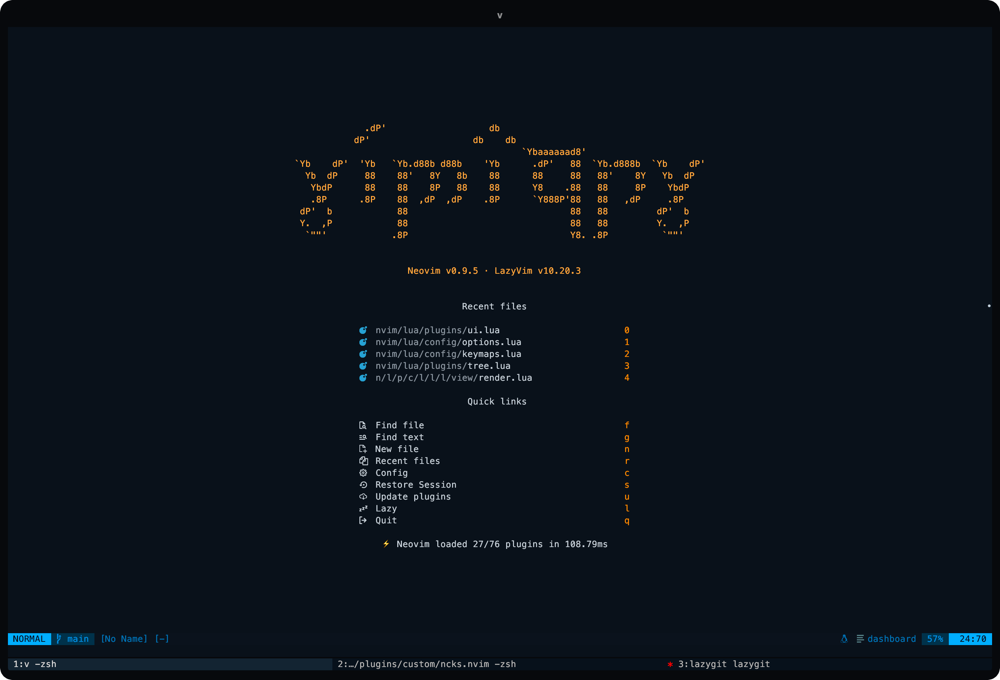

### Aliases

##### General

[zshrc](./zsh/.zshrc)

```bash
alias v='nvim' nv='nvim'
alias z-='z -'
alias cd..='z ..'
alias ..='z ..'
alias l='ls -t'
alias ll='ls -altrF'
alias lsa='ls -hla'
alias lsr='ls -lR'
alias lsf='ls -1 | wc -l'
alias lss='du -sh *'
alias la='ls -A'
alias ls='ls -CF'
alias cls='clear'
alias oldtop="/usr/bin/top"
alias nf="neofetch"
alias of="onefetch --no-color-palette --include-hidden -E --no-title"
alias ep="echo $PATH"
alias resh="source ~/.zshrc"
alias vzsh='kitty @ launch --type=tab nvim --remote-silent ~/.zshrc'
alias vlua='kitty @ launch --type=tab nvim --remote-silent ~/dotfiles/nvim'
alias zfq='zoxide query -l -s | less'
```

##### Git

```bash
alias ga='git add'
alias gaa='git add .'
alias gaaa='git add -A'
alias gc='git commit'
alias gcm='git commit -m'
alias gcr='git clone'
alias gd='git diff'
alias gi='git init'
alias gl='git log'
alias gp='git pull'
alias gpsh='git push'
alias gss='git status'
alias gcnt='git ls-files | wc -l'
alias lg='lazygit'
```

---

### Yabai/skhd

[yabairc](./yabai/.yabairc)
[skhdrc](/yabai/..skhdrc)

```bash
alias ystart='yabai --start-service'
alias ystop='yabai --stop-service'
alias yupgrade='brew upgrade yabai'
alias skstart='skhd --start-service'
alias skstop='skhd --stop-service'
```

---

#### Neovim Summary

Neovim: [v0.9.5](https://github.com/neovim/neovim) · LazyVim: [v10.22.0](https://github.com/LazyVim/LazyVim) · Colorscheme: [github_dark_colorblind](https://github.com/projekt0n/github-nvim-theme)

[nvim](./nvim/)

```lua
Total: 96 plugins

  Clean (7)
    ○ edgy.nvim 
    ○ github-nvim-theme 
    ○ gruvbox-baby 
    ○ neo-tree-harpoon.nvim 
    ○ oil.nvim 
    ○ oxocarbon.nvim 
    ○ spaceway.vim 

  Loaded (72)
    ● align.nvim 0.17ms  start -- https://github.com/Vonr/align.nvim
    ● alpha-nvim 3.72ms  VimEnter -- https://github.com/goolord/alpha-nvim
    ● bufferline.nvim 4.7ms  VeryLazy -- https://github.com/akinsho/bufferline.nvim
    ● cmp-buffer 12.31ms  nvim-cmp -- https://github.com/hrsh7th/cmp-buffer
    ● cmp-cmdline 1.8ms  nvim-cmp -- https://github.com/hrsh7th/cmp-cmdline
    ● cmp-nvim-lsp 1.03ms 󰢱 cmp_nvim_lsp  nvim-lspconfig -- https://github.com/hrsh7th/cmp-nvim-lsp
    ● cmp-path 1.28ms  nvim-cmp -- https://github.com/hrsh7th/cmp-path
    ● cmp_luasnip 1.34ms  nvim-cmp -- https://github.com/saadparwaiz1/cmp_luasnip
    ● Comment.nvim 4.1ms  start -- https://github.com/numToStr/Comment.nvim
    ● conform.nvim 12.37ms  start -- https://github.com/stevearc/conform.nvim
    ● copilot.lua 5.93ms  InsertEnter -- https://github.com/zbirenbaum/copilot.lua
    ● fidget.nvim 8.82ms  nvim-lspconfig -- https://github.com/j-hui/fidget.nvim
    ● flash.nvim 2.09ms  VeryLazy -- https://github.com/folke/flash.nvim
    ● friendly-snippets 24.87ms  LuaSnip -- https://github.com/rafamadriz/friendly-snippets
    ● gitsigns.nvim 3.34ms  nvim-scrollbar -- https://github.com/lewis6991/gitsigns.nvim
    ● go.nvim 31.98ms  CmdlineEnter -- https://github.com/ray-x/go.nvim
    ● guihua.lua 3.67ms  go.nvim -- https://github.com/ray-x/guihua.lua
    ● habamax.nvim 0.12ms  start -- https://github.com/ntk148v/habamax.nvim
    ● harpoon 0.7ms  start -- https://github.com/ThePrimeagen/harpoon
    ● hydra.nvim 1.1ms  multicursors.nvim -- https://github.com/smoka7/hydra.nvim
    ● indent-blankline.nvim 3.13ms  LazyFile -- https://github.com/lukas-reineke/indent-blankline.nvim
    ● lazy.nvim 26.26ms  init.lua -- https://github.com/folke/lazy.nvim
    ● LazyVim 1.97ms  start -- https://github.com/LazyVim/LazyVim
    ● lspkind.nvim 0.14ms  nvim-cmp -- https://github.com/onsails/lspkind.nvim
    ● lualine.nvim 10.49ms  VeryLazy -- https://github.com/nvim-lualine/lualine.nvim
    ● LuaSnip 27.66ms  nvim-cmp -- https://github.com/L3MON4D3/LuaSnip
    ● markdown-preview.nvim 1.11ms  markdown -- https://github.com/iamcco/markdown-preview.nvim
    ● mason-lspconfig.nvim 0.33ms  nvim-lspconfig -- https://github.com/williamboman/mason-lspconfig.nvim
    ● mason-tool-installer.nvim 4.34ms  nvim-lspconfig -- https://github.com/WhoIsSethDaniel/mason-tool-installer.nvim
    ● mason.nvim 11.18ms  conform.nvim -- https://github.com/williamboman/mason.nvim
    ● mini.ai 5.29ms  VeryLazy -- https://github.com/echasnovski/mini.ai
    ● mini.comment 0.69ms  VeryLazy -- https://github.com/echasnovski/mini.comment
    ● mini.indentscope 0.68ms  LazyFile -- https://github.com/echasnovski/mini.indentscope
    ● mini.nvim 0.97ms  start -- https://github.com/echasnovski/mini.nvim
    ● mini.pairs 1.19ms  VeryLazy -- https://github.com/echasnovski/mini.pairs
    ● multicursors.nvim 6.26ms  VeryLazy -- https://github.com/smoka7/multicursors.nvim
    ● ncks.nvim 2ms  start -- https://github.com/956MB/ncks.nvim
    ● neo-tree.nvim 13.5ms 󰢱 neo-tree.events  xcodebuild.nvim -- https://github.com/nvim-neo-tree/neo-tree.nvim
    ● neoconf.nvim 0.07ms 󰢱 neoconf.plugins  neodev.nvim -- https://github.com/folke/neoconf.nvim
    ● neodev.nvim 2.89ms  nvim-lspconfig -- https://github.com/folke/neodev.nvim
    ● nui.nvim 0.05ms  xcodebuild.nvim -- https://github.com/MunifTanjim/nui.nvim
    ● nvim-autopairs 3.32ms  InsertEnter -- https://github.com/windwp/nvim-autopairs
    ● nvim-cmp 49.81ms  InsertEnter -- https://github.com/hrsh7th/nvim-cmp
    ● nvim-dap 92.37ms  start -- https://github.com/mfussenegger/nvim-dap
    ● nvim-dap-ui 0.26ms 󰢱 dapui  nvim-dap -- https://github.com/rcarriga/nvim-dap-ui
    ● nvim-lint 1.04ms  LazyFile -- https://github.com/mfussenegger/nvim-lint
    ● nvim-lspconfig 30.45ms  LazyFile -- https://github.com/neovim/nvim-lspconfig
    ● nvim-nio 0.23ms  nvim-dap-ui -- https://github.com/nvim-neotest/nvim-nio
    ● nvim-notify 4.9ms 󰢱 notify  LazyVim -- https://github.com/rcarriga/nvim-notify
    ● nvim-scrollbar 4.77ms  start -- https://github.com/petertriho/nvim-scrollbar
    ● nvim-treesitter 11.32ms  VeryLazy -- https://github.com/nvim-treesitter/nvim-treesitter
    ● nvim-treesitter-context 1.54ms  LazyFile -- https://github.com/nvim-treesitter/nvim-treesitter-context
    ● nvim-treesitter-textobjects 7.19ms  nvim-treesitter -- https://github.com/nvim-treesitter/nvim-treesitter-textobjects
    ● nvim-ts-autotag 2.98ms  LazyFile -- https://github.com/windwp/nvim-ts-autotag
    ● nvim-web-devicons 18.45ms  telescope.nvim -- https://github.com/nvim-tree/nvim-web-devicons
    ● obsidian.nvim 22.98ms  markdown -- https://github.com/epwalsh/obsidian.nvim
    ● oil.nvim 1.62ms  start -- https://github.com/stevearc/oil.nvim
    ● persistence.nvim 1.9ms 󰢱 persistence  lua -- https://github.com/folke/persistence.nvim
    ● plenary.nvim 0.57ms  harpoon -- https://github.com/nvim-lua/plenary.nvim
    ● telescope-file-browser.nvim 0.04ms  start -- https://github.com/nvim-telescope/telescope-file-browser.nvim
    ● telescope-fzf-native.nvim 7.79ms  telescope.nvim -- https://github.com/nvim-telescope/telescope-fzf-native.nvim
    ● telescope-ui-select.nvim 0.05ms  telescope.nvim -- https://github.com/nvim-telescope/telescope-ui-select.nvim
    ● telescope.nvim 48.55ms  xcodebuild.nvim -- https://github.com/nvim-telescope/telescope.nvim
    ● todo-comments.nvim 3.05ms  VimEnter -- https://github.com/folke/todo-comments.nvim
    ● toggle-lsp-diagnostics.nvim 0.95ms  start -- https://github.com/WhoIsSethDaniel/toggle-lsp-diagnostics.nvim
    ● toggleterm.nvim 10.43ms  <C-\> -- https://github.com/akinsho/toggleterm.nvim
    ● trouble.nvim 6.63ms 󰢱 trouble  lua -- https://github.com/folke/trouble.nvim
    ● vim-illuminate 4.21ms  LazyFile -- https://github.com/RRethy/vim-illuminate
    ● vim-kitty 0.23ms  start -- https://github.com/fladson/vim-kitty
    ● vim-sleuth 0.65ms  start -- https://github.com/tpope/vim-sleuth
    ● which-key.nvim 9.98ms  VimEnter -- https://github.com/folke/which-key.nvim
    ● xcodebuild.nvim 86.72ms  nvim-dap -- https://github.com/wojciech-kulik/xcodebuild.nvim

  Not Loaded (13)
    ○ catppuccin -- https://github.com/catppuccin/nvim
    ○ dressing.nvim -- https://github.com/stevearc/dressing.nvim
    ○ gx.nvim  Browse  gx  gx (v) -- https://github.com/chrishrb/gx.nvim
    ○ lazygit.nvim  LazyGitConfig  LazyGitCurrentFile  LazyGitFilter  LazyGitFilterCurrentFile  LazyGit  <leader>lg -- https://github.com/kdheepak/lazygit.nvim
    ○ mini.bufremove  <leader>bD  <leader>bd -- https://github.com/echasnovski/mini.bufremove
    ○ mini.surround  gsh  gsa (v)  gsr  gsF  gsa  gsn  gsf  gsd -- https://github.com/echasnovski/mini.surround
    ○ nvim-spectre  Spectre  <leader>sr -- https://github.com/nvim-pack/nvim-spectre
    ○ nvim-ts-context-commentstring -- https://github.com/JoosepAlviste/nvim-ts-context-commentstring
    ○ rainbow_csv.nvim  RainbowMultiDelim  RainbowAlign  RainbowDelim  RainbowDelimSimple  RainbowDelimQuoted  csv  tsv  csv_semicolon  csv_whitespace  csv_pipe  rfc_csv  rfc_semicolon -- https://github.com/cameron-wags/rainbow_csv.nvim
    ○ vim-dadbod  vim-dadbod-ui -- https://github.com/tpope/vim-dadbod
    ○ vim-dadbod-completion  sqlite  sql  mysql  plsql  vim-dadbod-ui -- https://github.com/kristijanhusak/vim-dadbod-completion
    ○ vim-dadbod-ui  DBUIFindBuffer  DBUI  DBUIToggle  DBUIAddConnection -- https://github.com/kristijanhusak/vim-dadbod-ui
    ○ vim-startuptime  StartupTime -- https://github.com/dstein64/vim-startuptime

  Disabled (4)
    ○ dashboard-nvim -- https://github.com/nvimdev/dashboard-nvim
    ○ noice.nvim -- https://github.com/folke/noice.nvim
    ○ nvim -- https://github.com/catppuccin/nvim
    ○ tokyonight.nvim -- https://github.com/folke/tokyonight.nvim```
```

```python
                 -- --                    Project: dotfiles (1 branch)
         --                 -- @@@@       HEAD: 3225e00 (main)
      --      @@@@@@@@@@@     @@@@@@      Pending: 7+- 3+
           @@@@@@@@@@@@@@@@@   @@@@       Created: a month ago
  --     @@@@@@@@@@@@@@****@@@     --     Languages:                            
 --    @@@@@@@@@@@@@@@******@@@@    --               ● Lua (85.3 %) ● Shell (5.8 %)
      @@@@@@@@@@@@@@@@@****@@@@@@                    ● BASH (4.1 %) ● Python (3.1 %)
--   @@@**@@@@@@@@@@@@@@@@@@@@@@@@   --              ● Zsh (1.7 %) 
--   @@@**@@@@@@**@@**@@******@@@@   --   Author: 100% Alexander Bays <bays@956mb.com> 28
     @@@**@@@@@@**@@**@**@@@**@@@@        Last change: 14 seconds ago
--   @@@**@@@@@@**@@**@@@*****@@@@   --   URL: https://github.com/956MB/dotfiles.git
--   @@@**@@@@@@**@@**@***@@**@@@@   --   Commits: 28
      @@*******@******@********@@         Churn (1): .gitignore 1
 --    @@@@@@@@@@@@@@@@@@@@@@@@@    --               zsh/.zshrc 1
  --     @@@@@@@@@@@@@@@@@@@@@     --                …/config/autocmds.lua 1
           @@@@@@@@@@@@@@@@@              Lines of code: 1950
      --      @@@@@@@@@@@      --         Size: 1.44 MiB (54 files)
         --                 --            License: MIT
                 -- --                 
```

## License

[MIT license](./LICENSE)
